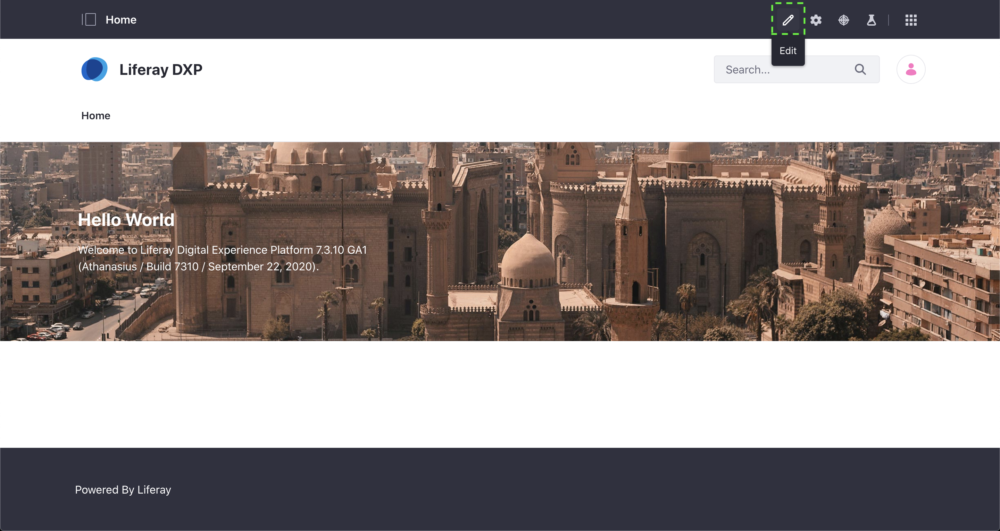
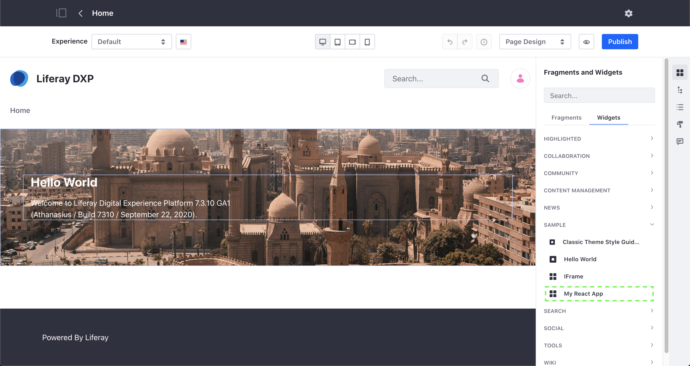

# Liferay React Example

## Setting Up Dependencies

Developed with:
```
node: v10.16.3
npm: 6.9.0
yo: 3.1.1
liferay-js: 2.24.3
```

1. Install node & npm (https://nodejs.org/en/download/)
2. Install yo `npm install -g yo`
3. Install liferay-js `npm install -g generator-liferay-js`

## Using the Liferay JS Generator

1. Run the Liferay JS Generator: `yo liferay-js` and follow the prompts:

	* What type of project do you want to create? `React Widget`
	* What name shall I give to the folder hosting your project? `my-react-app`
	* What is the human readable description of your project? `My React App`
	* Do you want to add localization support? `Y`
	* Do you want to add configuration support? `Y`
	* Under which category should your widget be listed? `category.sample`
	* Do you have a local installation of Liferay for development? `N` // If you are using Docker, answer no.
	* Do you want to generate sample code? `N`

At this stage you already have a working Liferay JS widget. You can run now build & deploy it and add it to a page.

## How to Build & Deploy

The steps to deploy your widget depend on where you are deploying it to. This tutorial will explain how to deploy to a Docker container and to a local Liferay bundle.

### Docker

1. Before we deploy to our Docker container we need to build our widget. We can build the widget using the following command:

```
npm run build
```

You can see what this command is actually doing by looking at the `package.json` file. You can find the build script under the scripts block.

The build command will compile your code and create a `.jar` file in the `dist/` directory.

2. In order to deploy to docker you need to know the `Container ID` for your Liferay Docker container. You can find this by running the command:

```
docker ps
```

This will list all of the containers that are currently running. Find your Liferay container and the `Container ID` will be in the first column.

3. With our `Container ID` we can deploy our newly built module using the `docker cp` command.

```
docker cp dist/[my-app.jar] [container]:/opt/liferay/deploy
```

### Local Liferay Bundle

If you have a local Liferay bundle and you're not using Docker, then you should have answered **Yes** to the question: Do you have a local installation of Liferay for development?

If you answered **Yes** you would have then been asked for the location of your local bundle. This location is stored in the `.npmbuildrc` file. If you want to deploy to a different bundle you can change the path in that file.

1. You can now run the following command to build and deploy your module:

```
npm run deploy
```

You can see what this command is actually doing by looking at the `package.json` file. You can find the deploy script under the scripts block. Notice that it runs the `build` command as part of the `deploy` command.

## Adding your Widget to a Page

To add it to to a page navigate to your Liferay instance and click on the edit icon on the page you want to add it to.



You can find the widget under the Widgets menu in the Sample category and drag the widget onto the page.



Currently our widget doesn't display anything so we will update the widget in the next steps.

We can now create our first React component.

## Creating a React Component

> NOTE: If at any time you have an issue with getting things working after copying code snippets, you can look at this repo which is a completed version of this tutorial. The git history can also provide helpful hints for how it was created.

1. In src create a new file: `App.js` with the following contents:
```
import React from 'react';

function App() {
	return (
		<h1>Hello World</h1>
	);
}

export default App;
```

We can include this component in our entry file `index.js`.

2. At the top of `index.js` add the following imports:
```
import React from 'react';
import ReactDOM from 'react-dom';

import App from './App';
```

The first two import statements are importing dependencies that have been included from our `package.json` file. The last import statement is importing the React component we just created. Notice that we import it using a relative path.

3. Then replace the export statement in `index.js` with the following:
```
export default function main({portletNamespace, contextPath, portletElementId, configuration}) {
	ReactDOM.render(
		<App />,
		document.getElementById(portletElementId)
	);
}
```

4. After saving your changes you can build & deploy the app to see a simple app that prints out "Hello World".

## React Hooks

Read about React Hooks [here](https://reactjs.org/docs/hooks-overview.html#state-hook).

The first React Hook we will use is the `useState` hook. Be sure to read about it before you begin. `useState` returns a pair: the current state value and a function that lets you update it. The only argument to useState is the initial state. We will use this hook to create a counter to see the value provided by React's state managment.

1. To use the `useState` hook, we have to import it. Change the line importing React in App.js to the following:
```
import React, {useState} from 'react';
```

After adding this import we can make use of `useState` in our component.

2. Replace the body of our App function in `App.js` with the following:
```
const [count, setCount] = useState(0);

return (
	<div>
		<h1>Hello World</h1>

		<button className="btn btn-primary" onClick={() => setCount(count + 1)}>Increment: {count}</button>
	</div>
);
```

This block of code creates a `count` variable that will be updated when we call the function `useCount`. We are providing it an initial value of `0`. We've modified our return statement to include a button that when clicked will call `setCount` and whose label displays the count.

3. After saving your changes you can build & deploy the app to see your changes.

## Calling APIs

We can call APIs in Liferay using the function `Liferay.Util.fetch` which is a simple wrapper around the web `fetch` api that handles authentication within Liferay.

Let's create a call to Liferay's APIs to return a list of users.

1. Create a new file `src/request.js` with the following contents:
```
export function getUsers() {
	return Liferay.Util.fetch(
		'/o/headless-admin-user/v1.0/user-accounts',
		{method: 'GET'}
	).then(res => res.json());
}
```

2. Replace the content of `App.js` with the following:
```
import React, {useEffect, useState} from 'react';

import {getUsers} from './request';

function App() {
	const [users, setUsers] = useState([]);

	useEffect(() => {
		getUsers().then(res => {
			setUsers(res.items);
		})
	}, []);

	return (
		<div>
			<h1>Users:</h1>

			{users.map(user => (
				<div key={user.id}>
					{user.givenName} {user.familyName}
				</div>
			))}
		</div>
	);
}

export default App;
```

We've added another hook, [`useEffect`](https://reactjs.org/docs/hooks-overview.html#effect-hook). This hook was created by React to properly handle side effects. It accepts a function and an array of dependencies. The function will only run when any of the dependencies change. By passing it an empty array we are telling it to only run once, which means our call to `getUsers` will only run once.

This function returns a [promise](https://developer.mozilla.org/en-US/docs/Web/JavaScript/Reference/Global_Objects/Promise). When this promise is returned we then call the function `setUsers` with the items returned by our api call.

In our return statement we are iterating through our users using the [map](https://developer.mozilla.org/en-US/docs/Web/JavaScript/Reference/Global_Objects/Array/map) function and render the name of each user inside a div.

3. After saving your changes you can build & deploy the app to see your changes.

We just saw how to get data from Liferay, but how do we get data from Liferay. Next let's create a component to add a user to Liferay.

## Using Clay

For this we are also going to use a pre-built React component from [Clay](https://clayui.com/docs/components/input.html).

1. To use a Clay component we first have to install it's npm module. In this case, we want to use the Clay form component, so we can install it using the following command:

```
npm install @clayui/form
```

After installing we can use it in our component by importing it in the top of our file like this:

```
import ClayForm, {ClayInput} from '@clayui/form';
```

To add a user we need to make another api call.

2. Add the following method to the `request.js` file:
```
export function addUser({emailAddress, familyName, givenName, userName}) {
	const data = {
		alternateName: userName,
		emailAddress,
		familyName,
		givenName
	};

	const headers = new Headers();

	headers.append('Content-Type', 'application/json');

	const request = {
		body: JSON.stringify(data),
		headers,
		method: 'POST'
	};

	return Liferay.Util.fetch(
		'/o/headless-admin-user/v1.0/user-accounts',
		request
	).then(res => res.json());
}
```

3. Create a new file `src/AddUserForm.js` with the following contents:
```
import React, {useCallback, useEffect, useState} from 'react';
import ClayForm, {ClayInput} from '@clayui/form';

import {addUser} from './request';

function AddUserForm() {
	const [emailAddress, setEmailAddress] = useState('');
	const [familyName, setFamilyName] = useState('');
	const [givenName, setGivenName] = useState('');
	const [userName, setUserName] = useState('');

	const onButtonSubmit = useCallback(() => {
		addUser({
			emailAddress,
			familyName,
			givenName,
			userName
		}).then(() => {
			setEmailAddress('');
			setFamilyName('');
			setGivenName('');
			setUserName('');
		});
	},
	[
		addUser,
		emailAddress,
		familyName,
		givenName,
		userName
	]);

	return (
		<div>
			<h1>Add User Form</h1>

			<ClayForm.Group>
				<label htmlFor="givenName">Given Name</label>

				<ClayInput
					id="givenName"
					onChange={event => setGivenName(event.target.value)}
					placeholder="Joe"
					type="text"
					value={givenName}
				/>
			</ClayForm.Group>
			<ClayForm.Group>
				<label htmlFor="familyName">Family Name</label>

				<ClayInput
					id="familyName"
					onChange={event => setFamilyName(event.target.value)}
					placeholder="Bloggs"
					type="text"
					value={familyName}
				/>
			</ClayForm.Group>
			<ClayForm.Group>
				<label htmlFor="emailAddress">Email Address</label>

				<ClayInput
					id="emailAddress"
					onChange={event => setEmailAddress(event.target.value)}
					placeholder="joe.bloggs@liferay.com"
					type="text"
					value={emailAddress}
				/>
			</ClayForm.Group>
			<ClayForm.Group>
				<label htmlFor="userName">User Name</label>

				<ClayInput
					id="userName"
					onChange={event => setUserName(event.target.value)}
					placeholder="jBloggs"
					type="text"
					value={userName}
				/>
			</ClayForm.Group>

			<button className="btn btn-primary" onClick={() => onButtonSubmit()}>Add User</button>
		</div>
	);
}

export default AddUserForm;
```

4. Finally, replace the contents of `App.js` with the following:
```
import React, {useEffect, useState} from 'react';

import AddUserForm from './AddUserForm';

import {getUsers} from './request';

function App() {
	const [users, setUsers] = useState([]);

	useEffect(() => {
		getUsers().then(res => {
			setUsers(res.items);
		})
	}, []);

	return (
		<div className="row">
			<div className="col-4">
				<h1>Users:</h1>

				{users.map(user => (
					<div key={user.id}>
						{user.givenName} {user.familyName}
					</div>
				))}
			</div>
			<div className="col-8">
				<AddUserForm />
			</div>
		</div>
	);
}

export default App;
```

5. After saving your changes you can build & deploy the app to see your changes.

You now have an app that can add users in addition to listing existing users. All the fields in the form are required, so if you don't add all of them you will end up with some javascript errors. We have not added the ability to automatically update the user list, so you will need to refresh the page after creating a user to see the new user in your list.

## Topics to Cover

* useCallback
* React Controlled Form Inputs
* Error Handling
* Etc.